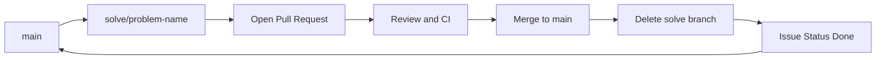

# Branch Strategy

このリポジトリは `github-flow` を採用します。

## Why github-flow

- 学習用リポジトリでは、長期運用ブランチを増やさない方がシンプル
- `main` を常にデプロイ可能（または常に安定）に保ちやすい
- 1課題=1PR の運用と相性が良い

`git-flow` のような `develop` ブランチは運用コストが増えるため採用しません。

## Branch Naming

課題ブランチは次の形式を使います。

- `{type}/{problem-name}`

`type` は以下を推奨します。

- `solve`: 問題を解くための実装
- `chore`: ディレクトリ整備や運用ドキュメント更新
- `fix`: 解答のバグ修正

例:

- `solve/two-sum`
- `solve/valid-parentheses`
- `fix/two-sum-edge-case`
- `chore/issue-label-maintenance`

`problem-name` は LeetCode の slug 相当を kebab-case で使用します。
`problem-name` はディレクトリ名 `solutions/leetcode/{problem-name}/` と一致させます。

使い分けルール:

- `solve`: 新しい問題を解くとき（通常はこちら）
- `fix`: 既存解答の修正
- `chore`: コード以外の運用更新（ドキュメント更新、Issue運用補助など）

## Pull Request Rule

- 1課題につき1PRを基本とする
- 課題が完了したら Issue の `status/*` を `done` に更新する
- 必要な検証結果・メモは Issue コメントに残す
- レビューで使う実装根拠（方針、計算量、トレードオフ）は PR 本文に記載する
- レビューで最終合意した決定事項は `solutions/leetcode/{problem-slug}/README.md` に反映する
- 3回運用時は `solution-3rd.ts` を最終提出対象とし、`solution-1st.ts` / `solution-2nd.ts` は学習過程として保持する
- PR作成時は `.github/pull_request_template.md` のチェックを満たす
- `main` にマージ後は対象ブランチを削除する（remote/local）
- PR のタイトル・本文・コメントは日本語で記述する

## Main Protection Rule

GitHub の `main` ブランチ保護で次を必須にします。

- Require a pull request before merging
- Require approvals: 0（現運用）
- Dismiss stale pull request approvals when new commits are pushed
- Require status checks to pass before merging（導入後のCIチェック名を対象に設定）
- Require branches to be up to date before merging
- Block force pushes
- Block deletions
- Restrict who can push to matching branches（必要時）

補足:

- 原則、`main` への直接 push は禁止
- `solve/*` から `main` へのマージ方式は `Squash and merge` を必須とする
- `fix/*` と `chore/*` も原則 `Squash and merge` を使う

## Done Definition

`status/done` は次の条件を満たした状態とします。

- 問題の解答コードが `main` にマージ済み
- ローカルで再実行可能な検証（テストまたは実行コマンド）が PR に記載済み
- 対応Issueに検証結果と必要なメモが記録済み
- PR のチェックリストが全て完了

## Flow (Mermaid)

## Directory Policy

ドキュメントは `docs/` 配下に保存します。
コミット運用ルールは `docs/10_workflow/commit-rules.md` を参照してください。
Issue ラベル運用ルールは `docs/10_workflow/issue-labels.md` を参照してください。
